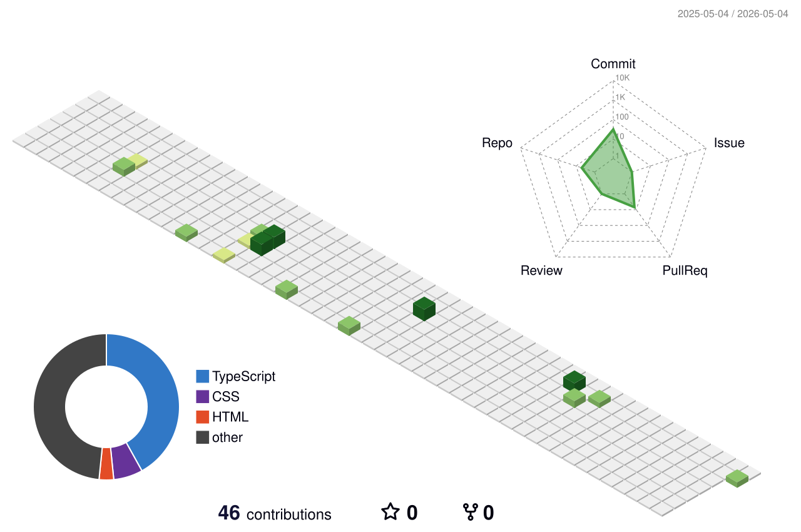

<!--
**kohsukee/kohsukee** is a ✨ _special_ ✨ repository because its `README.md` (this file) appears on your GitHub profile.

Here are some ideas to get you started:
[https://capsule-render.vercel.app/api?type=waving&height=300&color=gradient&text=Simpler%20is%20usually%20better]

- 🔭 I’m currently working on ...
- 🌱 I’m currently learning ...
- 👯 I’m looking to collaborate on ...
- 🤔 I’m looking for help with ...
- 💬 Ask me about ...
- 📫 How to reach me: ...
- 😄 Pronouns: ...
- ⚡ Fun fact: ...
-->
# Welcome to My GitHub Profile! 👋

## 🚀 About Me
- 💻 Full Stack Developer
- 🌱 Learning React and Node.js
- 👯 Looking to collaborate on web projects
- 📫 How to reach me: your-email@example.com

## 🛠️ Tech Stack

## 📊 GitHub Stats

